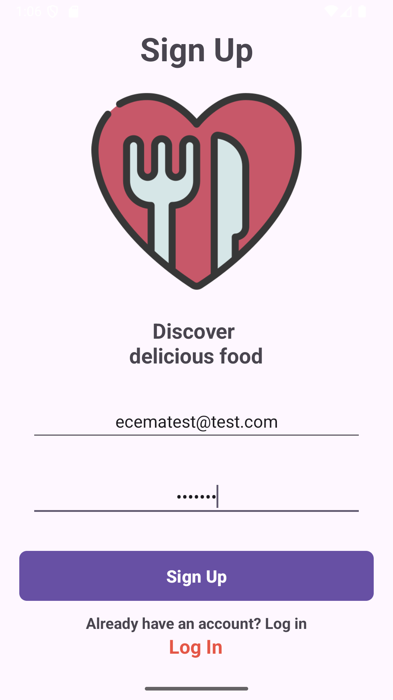
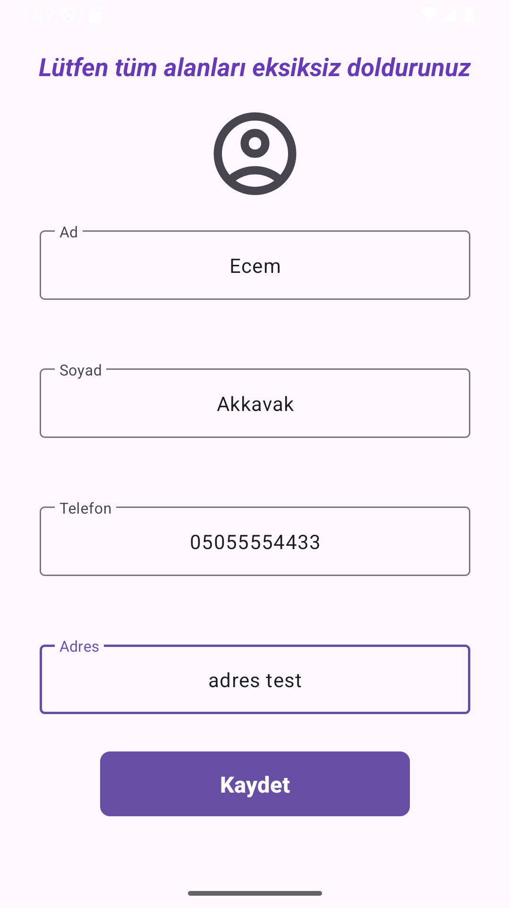
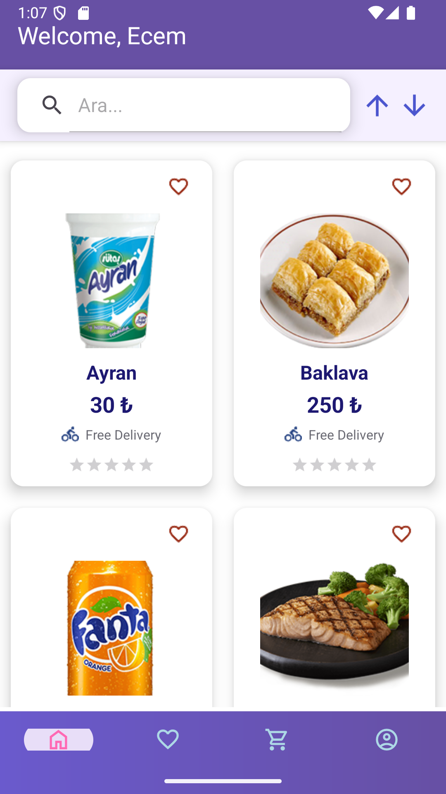
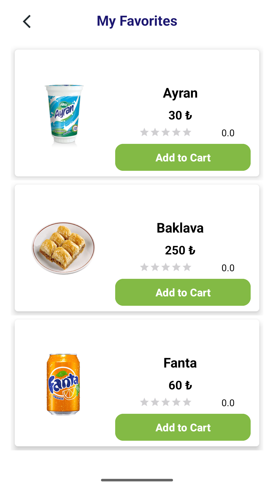
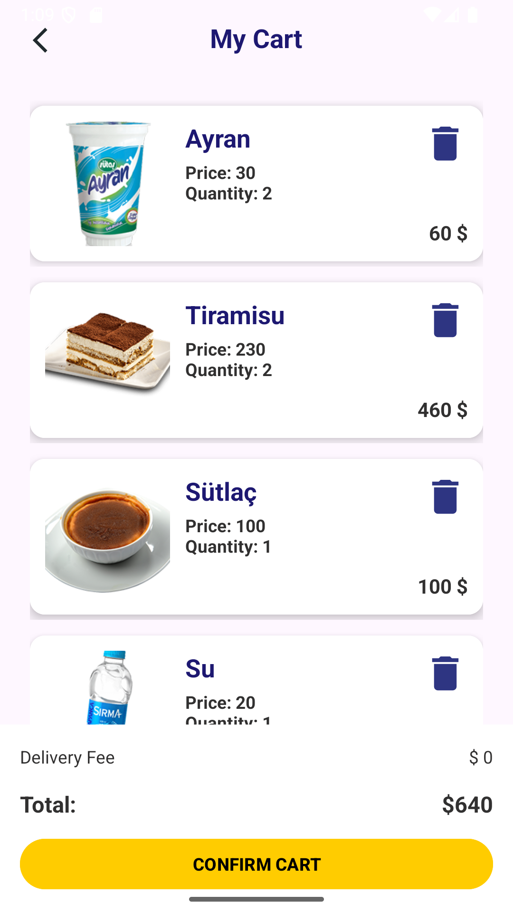
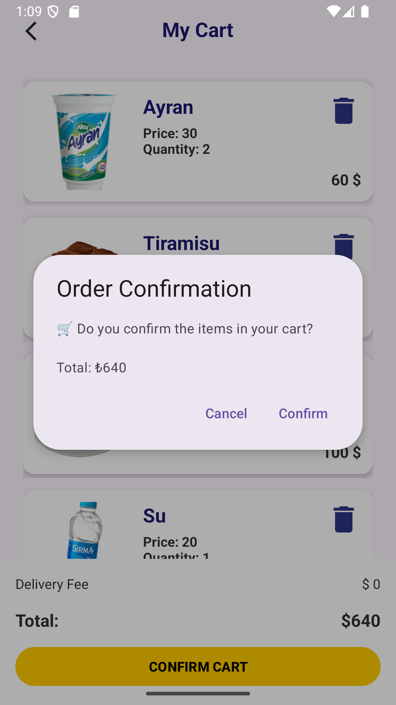
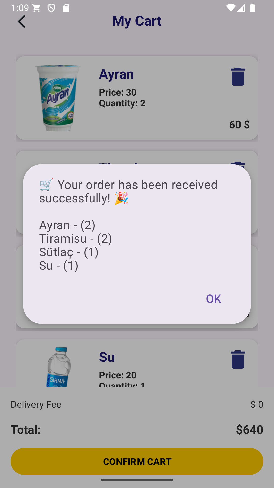
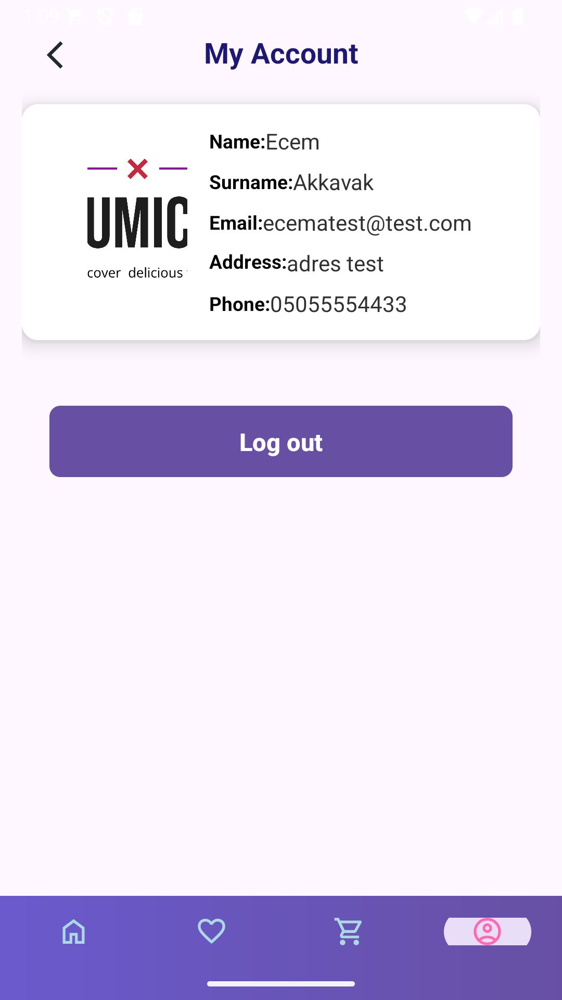

<h1>🛒 YUMICO</h1>

Yumico is a dynamic e-commerce mobile application designed to deliver a smooth and engaging shopping experience. Built with Android XML and Kotlin, it combines robust offline storage, cloud synchronization, efficient API integration, interactive notifications, and dual theme support. This project highlights advanced Android development skills, strong problem-solving abilities, and a commitment to delivering polished user experiences.

<h2>Content Overview</h2>
<ul>
  <li><a href="#project-description">Project Description</a></li>
  <li><a href="#features">Features</a></li>
  <li><a href="#technologies">Technologies Used</a></li>
  <li><a href="#screenshots">Screenshots</a></li>
  <li><a href="#contributors">Contributors</a></li>
</ul>

<h3 id="project-description">Project Description</h3>

Yumico allows users to browse products seamlessly, add favorites, rate items, and enjoy real-time updates. The application uses Room Database for offline storage, Firestore for cloud synchronization, and Retrofit for API communication. Glide provides fast and efficient image loading, while Data Binding ensures smooth interaction between XML layouts and Kotlin code. Snackbar messages, AlertDialog confirmations, and interactive notifications support user engagement and deliver immediate feedback, such as “Order Placed Successfully.”

The app focuses on usability, performance, and visual clarity. It features modern UI components, clean animations, and a responsive structure designed for an intuitive shopping experience. Every detail reflects a thoughtful approach to creating a robust, elegant, and user-friendly application.

<h3 id="features">Features</h3>
<ul>
  <li>📦 <strong>Product Catalog</strong> – Browse items by category, filter by preferences, and view details through a well-structured and smooth UI.</li>
  <li>❤️ <strong>Favorites</strong> – Save and manage favorites using Room Database for persistent offline access.</li>
  <li>⭐ <strong>Ratings</strong> – Users can rate products, with rating data stored and displayed consistently.</li>
  <li>🔄 <strong>Cloud Sync</strong> – Firestore synchronizes user data across devices for reliable and consistent access.</li>
  <li>🖼️ <strong>Image Handling</strong> – Glide ensures fast image loading, caching, and performance optimization.</li>
  <li>🔔 <strong>Interactive Notifications</strong> – Real-time feedback via Snackbar, AlertDialog, and system notifications.</li>
  <li>🌗 <strong>Dark Mode / Light Mode</strong> – Automatic theme adaptation based on the system’s appearance settings, providing visual comfort and a modern look.</li>
  <li>🌐 <strong>Multilingual Support</strong> – The application now supports both Turkish and English languages, providing a seamless experience for users in their preferred language.</li>
</ul>

<h3 id="technologies">Technologies Used</h3>
<table>
  <tr>
    <th>Icon</th>
    <th>Technology</th>
    <th>Description</th>
  </tr>
  <tr>
    <td>🏗️</td>
    <td><strong>Android XML</strong></td>
    <td>Used to design clean, efficient, and responsive layout structures.</td>
  </tr>
  <tr>
    <td>☕</td>
    <td><strong>Kotlin</strong></td>
    <td>Primary language responsible for core logic and feature implementation.</td>
  </tr>
  <tr>
    <td>🌐</td>
    <td><strong>Retrofit</strong></td>
    <td>Handles API requests, data transfer, and backend communication.</td>
  </tr>
  <tr>
    <td>🗃️</td>
    <td><strong>Room Database</strong></td>
    <td>Ensures secure local storage for favorites, ratings, and persistent user data.</td>
  </tr>
  <tr>
    <td>🔥</td>
    <td><strong>Firestore</strong></td>
    <td>Cloud synchronization for real-time and cross-device data consistency.</td>
  </tr>
  <tr>
    <td>🖼️</td>
    <td><strong>Glide</strong></td>
    <td>Optimized library for fast image loading and caching.</td>
  </tr>
  <tr>
    <td>🧩</td>
    <td><strong>Data Binding</strong></td>
    <td>Connects XML views directly with Kotlin code for reactive UI updates.</td>
  </tr>
  <tr>
    <td>🔔</td>
    <td><strong>Snackbar & AlertDialog</strong></td>
    <td>Delivers engaging and informative user feedback through visual prompts.</td>
  </tr>
  <tr>
    <td>🔄</td>
    <td><strong>Shared ViewModel</strong></td>
    <td>Facilitates seamless data sharing between fragments without redundancy.</td>
  </tr>
  <tr>
    <td>🌗</td>
    <td><strong>Dark Mode & Light Mode</strong></td>
    <td>Provides dual theme support that automatically adjusts to the device’s system theme, maintaining visual harmony across all UI elements.</td>
  </tr>
  <tr>
    <td>📱</td>
    <td><strong>Responsive UI Design</strong></td>
    <td>
      Optimized layouts for different screens:  
      • Small – compact components, stacked cards, simplified navigation.  
      • Medium – balanced layout, larger visuals, multi-column where suitable.  
      • Large – desktop-like structure, wider grids, spacious arrangement for big screens.
    </td>
  </tr>
</table>

<h3 id="screenshots">Screenshots</h3>
<table>
  <tr>
    <td align="center">
      
      
📝 Signup Page

    </td>
    <td align="center">
      
      
👤 Profile Detail

    </td>
    <td align="center">
      
      
🏠 Homepage

    </td>
    <td align="center">
      
      
❤️ Favorites

    </td>
  </tr>
  <tr>
    <td align="center">
      
      
🛒 Cart Page

    </td>
    <td align="center">
      
      
✅ Cart / Order Confirmation

    </td>
    <td align="center">
      
      
🔔 Cart Order Notification

    </td>
    <td align="center">
      
      
👤 Account Page

    </td>
  </tr>
</table>

<h3 id="contributors">Contributors</h3>

<a href="https://github.com/ecem-akkavak-tech/">Ecem Akkavak</a> – Main Developer & Project Owner

